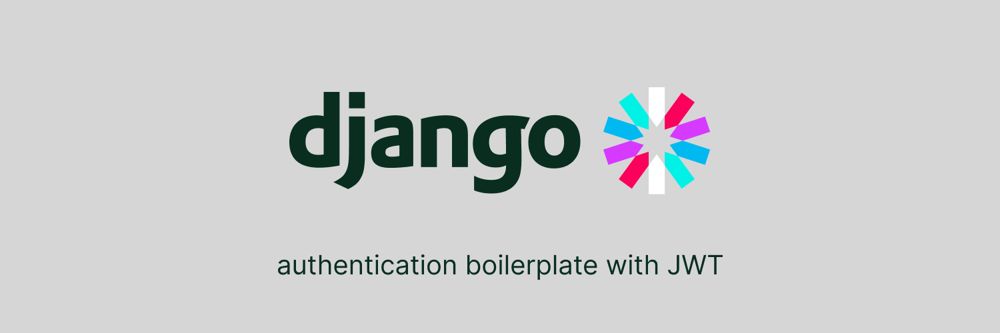

# Django JWT authentication boilerplate

<a href = "https://github.com/itsmais/telegram-bot-github-notifications">

</a>

## Overview

This boilerplate provides you with a basic Django project that implements JSON Web Tokens (JWT) authentication. It also has the `reset password` functionality.

## Steps

### 1- Clone the repository

Clone this repo and cd into the project directory `jwt_boilerplate`:

```bash
git clone https://github.com/itsmais/django-jwt-auth-boilerplate
cd django-jwt-auth-boilerplate/jwt_boilerplate
```

### 2- Set up the virtual environment

Start an environment called `env` and activate it:

```bash
python -m venv venv
source venv/bin/activate # for linux
venv\Scripts\activate # for windows
```

### 3- Install Django and needed dependencies

Install Django within the virtual environment along with the 2 dependencies:

```bash
pip install django djangorestframework djangorestframework-simplejwt
```

### 4- Running migrations and creating a superuser

Now, run migrations and create a superuser to be able to browse the admin dashboard and test this code:

```bash
python manage.py makemigrations authentication
python manage.py migrate
python manage.py createsuperuser
python manage.py runserver # optional: just to see how things are looking
```

### 5- Choose an email to send notifications from

Now, we need to give Django access to an email address to be able to send password reset notifications from it.

I chose to do this with a Gmail account, utilizing App Passwords. Here's a [full guide](https://support.google.com/mail/answer/185833?hl=en) on creating an App Password for a Gmail account. Once you have that, save it for the next step.

### 6- Configure Django to send password reset emails

In `settings.py`, change the email values depending on your provider. Of course, I am assuming that you would use a safe way to save and retrieve those passwords (like env variables) but this is out of scope for this guide.

```py
EMAIL_BACKEND = 'django.core.mail.backends.smtp.EmailBackend'
EMAIL_HOST = 'smtp.gmail.com'  # change to your provider
EMAIL_PORT = 587
EMAIL_USE_TLS = True
EMAIL_HOST_USER = 'name@gmail.com'  # change email address
EMAIL_HOST_PASSWORD = 'my app password'  # email password
```

## Running the code

### Registering a new user

```bash
curl -X POST http://localhost:8000/api/register/ -H "Content-Type: application/json" -d '{
    "username": "username",
    "email": "user@example.com",
    "password": "password"
}'

```

### Signing in

```bash
curl -X POST http://localhost:8000/api/token/ -H "Content-Type: application/json" -d '{
    "username": "username",
    "password": "password"
}'
```

### Resetting password

### Singing in

### Reset password

To reset a a password, open http://localhost:8000/password_reset/ in the browser. Type in your email, and Django will send a reset link. This workflow uses Django's default views for this functionality.

## Final words

Before you include this code in production, make sure that you follow the usual django checklist that you must follow before deployment, like taking care of the `SECRET_KEY` in `settings.py`, setting `DEBUG`to`false`, etc.

## References

- [Virtual environments in Python](https://docs.python.org/3/library/venv.html)
- [Django REST framework](https://www.django-rest-framework.org/)
- [Simple JWT plugin](https://django-rest-framework-simplejwt.readthedocs.io/en/latest/)
- [Gmail's App Passwords](https://support.google.com/mail/answer/185833?hl=en)
